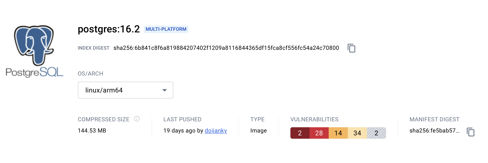
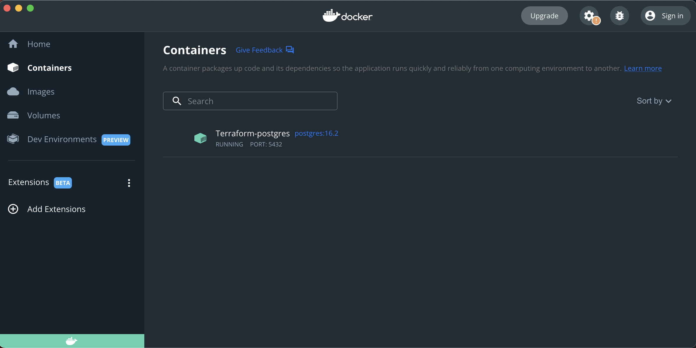
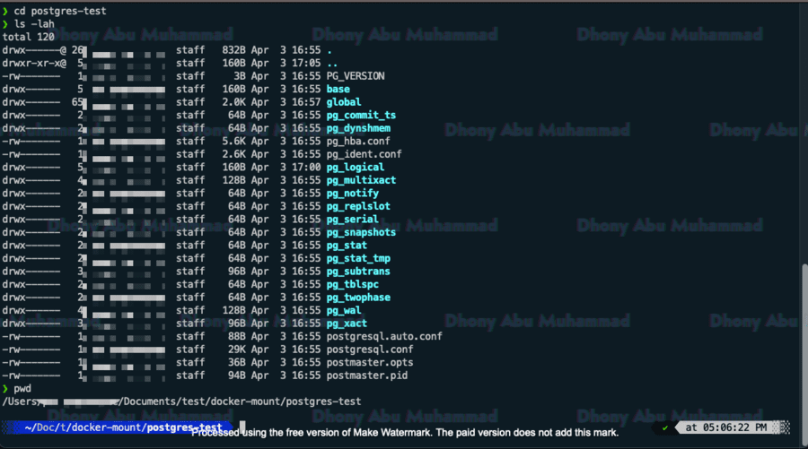
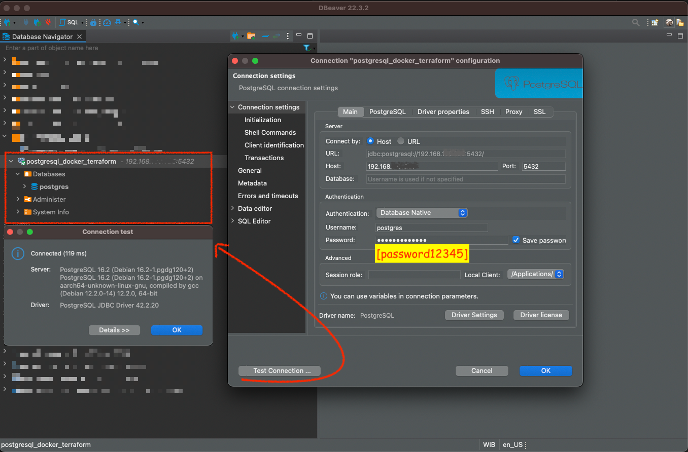

&nbsp;

Reference : 
- Doc. | Docker Kreuzwerker Provider
  <pre>https://registry.terraform.io/providers/kreuzwerker/docker/latest/docs</pre>

- An example if done using the docker run command.
    <pre>
        ❯ docker run -d \
        --name postgres-container \
        -e POSTGRES_USER=postgres \
        -e POSTGRES_PASSWORD=postgres \
        -p 5432:5432 \
        -v ~/Documents/test/docker-mount/postgres-test:/var/lib/postgresql/data \
        postgres:16.2
    </pre>

---

&nbsp;

## &#x1F6A9; Terraform TF-Docker-postgresql = docker postgresql:16.2

    
    
https://hub.docker.com/layers/library/postgres/16.2/images/sha256-fe5bab5720ec73a61209666d67c6ce5a20861a0a8f58115dd594c85a900e958a?context=explore

&nbsp;

&nbsp;

### &#127937; Start terraform infastructure exercise as code.

<pre>
    ❯ vim TF-Docker-postgresql/provider.tf
</pre>
<pre>
        terraform {
          required_providers {
            docker = {
              source  = "kreuzwerker/docker"
              version = "3.0.2"
            }
            null = {
              source = "hashicorp/null"
            }    
          }
        }
        
        provider "docker" {
          host = "unix:///var/run/docker.sock"
        }
</pre>

&nbsp;

<pre>
    ❯ vim TF-Docker-postgresql/main.tf
</pre>
<pre>
            resource "docker_image" "postgres" {
              name         = "postgres:16.2"
              keep_locally = false
            }
            
            resource "null_resource" "manage_directory" {
              triggers = {
                always_run = "${timestamp()}"
              }
            
              # Mengecek apakah direktori kosong atau mengandung folder pg_*
              provisioner "local-exec" {
                command = <<-EOT
                  if [ -n "$(find ${var.datatest_directory} -mindepth 1 -maxdepth 1 -type d -name 'pg_*' -print -quit)" ]; then
                    echo "Direktori mengandung setidaknya satu folder yang dimulai dengan 'pg_' sehingga tidak diperlukan perlakukan apapun terhadap direktori tersebut."
                  else
                    rm -rf ${var.datatest_directory} && mkdir -p ${var.datatest_directory}
                  fi
                EOT
              }
            }
            
            
            resource "docker_container" "postgres" {
              image    = docker_image.postgres.name
              name     = "Terraform-postgres"
              must_run = true
              memory   = 512
            
            
              ports {
                internal = 5432
                external = 5432
                ip       = "0.0.0.0"
              }
            
              env = [
                "POSTGRES_USER=postgres",
                "POSTGRES_PASSWORD=${var.postgres_password}",
              ]
              volumes {
                # volume_name    = "postgres_data"
                host_path      = var.datatest_directory
                container_path = "/var/lib/postgresql/data"
              }
            }
</pre>

&nbsp;

<pre>
    ❯ vim TF-Docker-postgresql/variables.tf
</pre>
<pre>
        variable "postgres_password" {
            type        = string
            description = "Password for PostgreSQL database"
            sensitive   = true
        }

        variable "datatest_directory" {
            description = "Path to the datatest directory"
            default     = "~/Documents/test/docker-mount/postgres-test/"
        }
</pre>

&nbsp;

<pre>
    ❯ mkdir TF-Docker-postgresql/secret

    ❯ vim TF-Docker-postgresql/secret/terraform_postgres.tfvars

            postgres_password = "password123"
</pre>

&nbsp;

<pre>
    ❯ vim TF-Docker-postgresql/outputs.tf
</pre>
<pre>
        output "docker_container_name" {
            value = "HI, INI OUTPUT KU = ${docker_container.postgres.name}"
        }
</pre>

&nbsp;

<pre>
    ❯ tree -L 2 -a -I 'README.md|.DS_Store|.terraform|*.hcl|*.tfstate|*.tfstate.backup' ./TF-Docker-postgresql
        ├── main.tf
        ├── outputs.tf
        ├── provider.tf
        ├── secret
        │   └── terraform_postgres.tfvars
        └── variables.tf
        
        1 directory, 5 files
</pre>

&nbsp;

### &#x1F530; TERRAFORM STAGES :

<pre>
    ❯ terraform -chdir=./TF-Docker-postgresql init

            Initializing the backend...

            Initializing provider plugins...
            - Finding latest version of hashicorp/null...
            - Finding kreuzwerker/docker versions matching "3.0.2"...
            - Installing hashicorp/null v3.2.2...
            - Installed hashicorp/null v3.2.2 (signed by HashiCorp)
            - Installing kreuzwerker/docker v3.0.2...
            - Installed kreuzwerker/docker v3.0.2 (self-signed, key ID BD080C4571C6104C)

            Partner and community providers are signed by their developers.
            If you'd like to know more about provider signing, you can read about it here:
            https://www.terraform.io/docs/cli/plugins/signing.html

            Terraform has created a lock file .terraform.lock.hcl to record the provider
            selections it made above. Include this file in your version control repository
            so that Terraform can guarantee to make the same selections by default when
            you run "terraform init" in the future.

            Terraform has been successfully initialized!

            You may now begin working with Terraform. Try running "terraform plan" to see
            any changes that are required for your infrastructure. All Terraform commands
            should now work.

            If you ever set or change modules or backend configuration for Terraform,
            rerun this command to reinitialize your working directory. If you forget, other
            commands will detect it and remind you to do so if necessary.
</pre>

&nbsp;

<pre>
    ❯ terraform -chdir=./TF-Docker-nginx fmt

    ❯ terraform -chdir=./TF-Docker-nginx validate

            Success! The configuration is valid.
</pre>

&nbsp;

<pre>
    ❯ terraform -chdir=./TF-Docker-postgresql plan -var-file=./secret/terraform_postgres.tfvars

            Terraform used the selected providers to generate the following execution plan. Resource actions are indicated with the following symbols:
            + create

            Terraform will perform the following actions:

            # docker_container.postgres will be created
            + resource "docker_container" "postgres" {
                + attach                                      = false
                + bridge                                      = (known after apply)
                + command                                     = (known after apply)
                + container_logs                              = (known after apply)
                + container_read_refresh_timeout_milliseconds = 15000
                + entrypoint                                  = (known after apply)
                + env                                         = (sensitive value)
                + exit_code                                   = (known after apply)
                + hostname                                    = (known after apply)
                + id                                          = (known after apply)
                + image                                       = "postgres:16.2"
                + init                                        = (known after apply)
                + ipc_mode                                    = (known after apply)
                + log_driver                                  = (known after apply)
                + logs                                        = false
                + memory                                      = 512
                + must_run                                    = true
                + name                                        = "Terraform-postgres"
                + network_data                                = (known after apply)
                + read_only                                   = false
                + remove_volumes                              = true
                + restart                                     = "no"
                + rm                                          = false
                + runtime                                     = (known after apply)
                + security_opts                               = (known after apply)
                + shm_size                                    = (known after apply)
                + start                                       = true
                + stdin_open                                  = false
                + stop_signal                                 = (known after apply)
                + stop_timeout                                = (known after apply)
                + tty                                         = false
                + wait                                        = false
                + wait_timeout                                = 60

                + ports {
                    + external = 5432
                    + internal = 5432
                    + ip       = "0.0.0.0"
                    + protocol = "tcp"
                    }

                + volumes {
                    + container_path = "/var/lib/postgresql/data"
                    + host_path      = "/Users/.../Documents/test/docker-mount/postgres-test/"
                    }
                }

            # docker_image.postgres will be created
            + resource "docker_image" "postgres" {
                + id           = (known after apply)
                + image_id     = (known after apply)
                + keep_locally = false
                + name         = "postgres:16.2"
                + repo_digest  = (known after apply)
                }

            # null_resource.manage_directory will be created
            + resource "null_resource" "manage_directory" {
                + id       = (known after apply)
                + triggers = {
                    + "always_run" = (known after apply)
                    }
                }

            Plan: 3 to add, 0 to change, 0 to destroy.

            Changes to Outputs:
            + docker_container_name = "HI, INI OUTPUT KU = Terraform-postgres"

            ───────────────────────────────────────────────────────────────────────────────────────────────────────────────────────────────────────────────────────────────────────────────

            Note: You didn't use the -out option to save this plan, so Terraform can't guarantee to take exactly these actions if you run "terraform apply" now.
</pre>

&nbsp;

<pre>
    ❯ terraform -chdir=./TF-Docker-postgresql apply -var-file=./secret/terraform_postgres.tfvars

            Terraform used the selected providers to generate the following execution plan. Resource actions are indicated with the following symbols:
            + create

            Terraform will perform the following actions:

            # docker_container.postgres will be created
            + resource "docker_container" "postgres" {
                + attach                                      = false
                + bridge                                      = (known after apply)
                + command                                     = (known after apply)
                + container_logs                              = (known after apply)
                + container_read_refresh_timeout_milliseconds = 15000
                + entrypoint                                  = (known after apply)
                + env                                         = (sensitive value)
                + exit_code                                   = (known after apply)
                + hostname                                    = (known after apply)
                + id                                          = (known after apply)
                + image                                       = "postgres:16.2"
                + init                                        = (known after apply)
                + ipc_mode                                    = (known after apply)
                + log_driver                                  = (known after apply)
                + logs                                        = false
                + memory                                      = 512
                + must_run                                    = true
                + name                                        = "Terraform-postgres"
                + network_data                                = (known after apply)
                + read_only                                   = false
                + remove_volumes                              = true
                + restart                                     = "no"
                + rm                                          = false
                + runtime                                     = (known after apply)
                + security_opts                               = (known after apply)
                + shm_size                                    = (known after apply)
                + start                                       = true
                + stdin_open                                  = false
                + stop_signal                                 = (known after apply)
                + stop_timeout                                = (known after apply)
                + tty                                         = false
                + wait                                        = false
                + wait_timeout                                = 60

                + ports {
                    + external = 5432
                    + internal = 5432
                    + ip       = "0.0.0.0"
                    + protocol = "tcp"
                    }

                + volumes {
                    + container_path = "/var/lib/postgresql/data"
                    + host_path      = "/Users/.../Documents/test/docker-mount/postgres-test/"
                    }
                }

            # docker_image.postgres will be created
            + resource "docker_image" "postgres" {
                + id           = (known after apply)
                + image_id     = (known after apply)
                + keep_locally = false
                + name         = "postgres:16.2"
                + repo_digest  = (known after apply)
                }

            # null_resource.manage_directory will be created
            + resource "null_resource" "manage_directory" {
                + id       = (known after apply)
                + triggers = {
                    + "always_run" = (known after apply)
                    }
                }

            Plan: 3 to add, 0 to change, 0 to destroy.

            Changes to Outputs:
            + docker_container_name = "HI, INI OUTPUT KU = Terraform-postgres"

            Do you want to perform these actions?
            Terraform will perform the actions described above.
            Only 'yes' will be accepted to approve.

            Enter a value: yes

            null_resource.manage_directory: Creating...
            null_resource.manage_directory: Provisioning with 'local-exec'...
            null_resource.manage_directory (local-exec): Executing: ["/bin/sh" "-c" "if [ -n \"$(find /Users/.../Documents/test/docker-mount/postgres-test/ -mindepth 1 -maxdepth 1 -type d -name 'pg_*' -print -quit)\" ]; then\n  echo \"Direktori mengandung setidaknya satu folder yang dimulai dengan 'pg_' sehingga tidak diperlukan perlakukan apapun terhadap direktori tersebut.\"\nelse\n  rm -rf /Users/.../Documents/test/docker-mount/postgres-test/ && mkdir -p /Users/.../Documents/test/docker-mount/postgres-test/\nfi\n"]
            docker_image.postgres: Creating...
            null_resource.manage_directory: Creation complete after 0s [id=6943011660953020159]
            docker_image.postgres: Still creating... [10s elapsed]
            docker_image.postgres: Still creating... [20s elapsed]
            docker_image.postgres: Still creating... [30s elapsed]
            docker_image.postgres: Still creating... [40s elapsed]
            docker_image.postgres: Still creating... [50s elapsed]
            docker_image.postgres: Creation complete after 57s [id=sha256:eae233f106f633adc0f551b7bfb6766149fddec54458520cafa6ac849ae1b00cpostgres:16.2]
            docker_container.postgres: Creating...
            docker_container.postgres: Creation complete after 1s [id=141cf9f9bf552a219bad88db8ec42ebe0d699217eb0fd2125386e2a57d1efa88]

            Apply complete! Resources: 3 added, 0 changed, 0 destroyed.

            Outputs:

            docker_container_name = "HI, INI OUTPUT KU = Terraform-postgres" 
</pre>

&nbsp;

---

If you want to run stage apply with auto approve on the confirmation.
<pre>
    ❯ terraform -chdir=./TF-Docker-postgresql apply -var-file=./secret/terraform_postgres.tfvars -auto-approve
</pre>

&nbsp;

&#x1F534; If you want to display the `trace log`, you can use the following command in the apply stage of this terraform &#x1F3C3;.
<pre>
    ❯ TF_LOG_CORE=trace terraform -chdir=./TF-Docker-postgresql apply -var-file=./secret/terraform_postgres.tfvars
</pre>

---

&nbsp;

### &#x1F530; Result.

<pre>
    ❯ docker images

        REPOSITORY   TAG          IMAGE ID       CREATED       SIZE
        nginx        alpine3.18   b8c82647e8a2   6 weeks ago   43.6MB

    ❯ docker container list

        CONTAINER ID   IMAGE           COMMAND                  CREATED         STATUS         PORTS                    NAMES
        141cf9f9bf55   postgres:16.2   "docker-entrypoint.s…"   5 minutes ago   Up 5 minutes   0.0.0.0:5432->5432/tcp   Terraform-postgres</pre>

    

&nbsp;

State after which the directory is mounted with volumes.

    

&nbsp;

&nbsp;

Implement a postgresql connection using DBEAVER to the Terraform-postgres container endpoint and test creating a database named 'db_test123'.

    

<pre>
        postgres-# \l

                                                               List of databases
            Name    |  Owner   | Encoding | Locale Provider |  Collate   |   Ctype    | ICU Locale | ICU Rules |   Access privileges
        ------------+----------+----------+-----------------+------------+------------+------------+-----------+-----------------------
         db_test123 | postgres | UTF8     | libc            | en_US.utf8 | en_US.utf8 |            |           |
         postgres   | postgres | UTF8     | libc            | en_US.utf8 | en_US.utf8 |            |           |
</pre>

&nbsp;

<pre>
    ❯ terraform -chdir=./TF-Docker-postgresql destroy -var-file=./secret/terraform_postgres.tfvars

            null_resource.manage_directory: Refreshing state... [id=6943011660953020159]
            docker_image.postgres: Refreshing state... [id=sha256:eae233f106f633adc0f551b7bfb6766149fddec54458520cafa6ac849ae1b00cpostgres:16.2]
            docker_container.postgres: Refreshing state... [id=141cf9f9bf552a219bad88db8ec42ebe0d699217eb0fd2125386e2a57d1efa88]

            Terraform used the selected providers to generate the following execution plan. Resource actions are indicated with the following symbols:
            - destroy

            Terraform will perform the following actions:

            # docker_container.postgres will be destroyed
            - resource "docker_container" "postgres" {
                - attach                                      = false -> null
                - command                                     = [
                    - "postgres",
                    ] -> null
                - container_read_refresh_timeout_milliseconds = 15000 -> null
                - cpu_shares                                  = 0 -> null
                - dns                                         = [] -> null
                - dns_opts                                    = [] -> null
                - dns_search                                  = [] -> null
                - entrypoint                                  = [
                    - "docker-entrypoint.sh",
                    ] -> null
                - env                                         = (sensitive value) -> null
                - group_add                                   = [] -> null
                - hostname                                    = "141cf9f9bf55" -> null
                - id                                          = "141cf9f9bf552a219bad88db8ec42ebe0d699217eb0fd2125386e2a57d1efa88" -> null
                - image                                       = "sha256:eae233f106f633adc0f551b7bfb6766149fddec54458520cafa6ac849ae1b00c" -> null
                - init                                        = false -> null
                - ipc_mode                                    = "private" -> null
                - log_driver                                  = "json-file" -> null
                - log_opts                                    = {} -> null
                - logs                                        = false -> null
                - max_retry_count                             = 0 -> null
                - memory                                      = 512 -> null
                - memory_swap                                 = 1024 -> null
                - must_run                                    = true -> null
                - name                                        = "Terraform-postgres" -> null
                - network_data                                = [
                    - {
                        - gateway                   = "172.17.0.1"
                        - global_ipv6_address       = ""
                        - global_ipv6_prefix_length = 0
                        - ip_address                = "172.17.0.2"
                        - ip_prefix_length          = 16
                        - ipv6_gateway              = ""
                        - mac_address               = "02:42:ac:11:00:02"
                        - network_name              = "bridge"
                        },
                    ] -> null
                - network_mode                                = "default" -> null
                - privileged                                  = false -> null
                - publish_all_ports                           = false -> null
                - read_only                                   = false -> null
                - remove_volumes                              = true -> null
                - restart                                     = "no" -> null
                - rm                                          = false -> null
                - runtime                                     = "runc" -> null
                - security_opts                               = [] -> null
                - shm_size                                    = 64 -> null
                - start                                       = true -> null
                - stdin_open                                  = false -> null
                - stop_signal                                 = "SIGINT" -> null
                - stop_timeout                                = 0 -> null
                - storage_opts                                = {} -> null
                - sysctls                                     = {} -> null
                - tmpfs                                       = {} -> null
                - tty                                         = false -> null
                - wait                                        = false -> null
                - wait_timeout                                = 60 -> null

                - ports {
                    - external = 5432 -> null
                    - internal = 5432 -> null
                    - ip       = "0.0.0.0" -> null
                    - protocol = "tcp" -> null
                    }

                - volumes {
                    - container_path = "/var/lib/postgresql/data" -> null
                    - host_path      = "/Users/.../Documents/test/docker-mount/postgres-test/" -> null
                    - read_only      = false -> null
                    }
                }

            # docker_image.postgres will be destroyed
            - resource "docker_image" "postgres" {
                - id           = "sha256:eae233f106f633adc0f551b7bfb6766149fddec54458520cafa6ac849ae1b00cpostgres:16.2" -> null
                - image_id     = "sha256:eae233f106f633adc0f551b7bfb6766149fddec54458520cafa6ac849ae1b00c" -> null
                - keep_locally = false -> null
                - name         = "postgres:16.2" -> null
                - repo_digest  = "postgres@sha256:6b841c8f6a819884207402f1209a8116844365df15fca8cf556fc54a24c70800" -> null
                }

            # null_resource.manage_directory will be destroyed
            - resource "null_resource" "manage_directory" {
                - id       = "6943011660953020159" -> null
                - triggers = {
                    - "always_run" = "2024-04-03T09:54:31Z"
                    } -> null
                }

            Plan: 0 to add, 0 to change, 3 to destroy.

            Changes to Outputs:
            - docker_container_name = "HI, INI OUTPUT KU = Terraform-postgres" -> null

            Do you really want to destroy all resources?
            Terraform will destroy all your managed infrastructure, as shown above.
            There is no undo. Only 'yes' will be accepted to confirm.

            Enter a value: yes

            null_resource.manage_directory: Destroying... [id=6943011660953020159]
            null_resource.manage_directory: Destruction complete after 0s
            docker_container.postgres: Destroying... [id=141cf9f9bf552a219bad88db8ec42ebe0d699217eb0fd2125386e2a57d1efa88]
            docker_container.postgres: Destruction complete after 1s
            docker_image.postgres: Destroying... [id=sha256:eae233f106f633adc0f551b7bfb6766149fddec54458520cafa6ac849ae1b00cpostgres:16.2]
            docker_image.postgres: Destruction complete after 0s

            Destroy complete! Resources: 3 destroyed.
</pre>

&nbsp;

<pre>
    ❯  docker images

            REPOSITORY   TAG       IMAGE ID   CREATED   SIZE

    ❯ docker ps -a

            CONTAINER ID   IMAGE     COMMAND   CREATED   STATUS    PORTS     NAMES
</pre>

&nbsp;

&nbsp;

---

&nbsp;

    

&nbsp;
