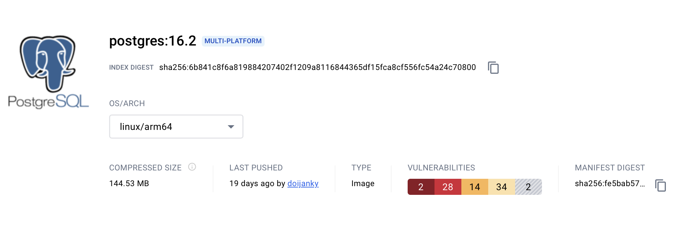

&nbsp;

Reference : 
- Doc. | Docker Kreuzwerker Provider
  <pre>https://registry.terraform.io/providers/kreuzwerker/docker/latest/docs</pre>

---

&nbsp;

## &#x1F6A9; Terraform TF-Module-Docker-postgresql = docker postgresql:16.2

    
    
https://hub.docker.com/layers/library/postgres/16.2/images/sha256-fe5bab5720ec73a61209666d67c6ce5a20861a0a8f58115dd594c85a900e958a?context=explore

&nbsp;

&nbsp;

### &#127937; Start terraform infastructure exercise as code.

&nbsp;

<pre>
    ❯ tree -L 2 -a -I 'README.md|.DS_Store|.terraform|*.hcl|*.tfstate|*.tfstate.backup' ./TF-Module-Docker-postgresql
        ├── main.tf
        ├── outputs.tf
        ├── provider.tf
        ├── secret
        │   └── terraform_postgres.tfvars
        └── variables.tf
        
        1 directory, 5 files
</pre>

&nbsp;

### &#x1F530; TERRAFORM STAGES :

<pre>
    ❯ terraform -chdir=./TF-Module-docker-multi-image init

</pre>

&nbsp;

<pre>
    ❯ terraform -chdir=./TF-Module-docker-multi-image fmt -recursive

    ❯ terraform -chdir=./TF-Module-docker-multi-image validate

            Success! The configuration is valid.
</pre>

&nbsp;

<pre>
    ❯ terraform -chdir=./TF-Module-docker-multi-image plan

</pre>

&nbsp;

<pre>
    ❯ terraform -chdir=./TF-Module-docker-multi-image apply -auto-approve

</pre>

&nbsp;

---

&nbsp;

&#x1F534; If you want to display the `trace log`, you can use the following command in the apply stage of this terraform &#x1F3C3;.
<pre>
    ❯ TF_LOG_CORE=trace terraform -chdir=./TF-Module-docker-multi-image apply
</pre>

---

&nbsp;

### &#x1F530; Result.

<pre>
    ❯ docker images

    ❯ docker container list

&nbsp;

<pre>
    ❯ terraform -chdir=./TF-Module-docker-multi-image destroy

</pre>

&nbsp;

<pre>
    ❯  docker images

            REPOSITORY   TAG       IMAGE ID   CREATED   SIZE

    ❯ docker ps -a

            CONTAINER ID   IMAGE     COMMAND   CREATED   STATUS    PORTS     NAMES
</pre>

&nbsp;

&nbsp;

---

&nbsp;

    

&nbsp;
